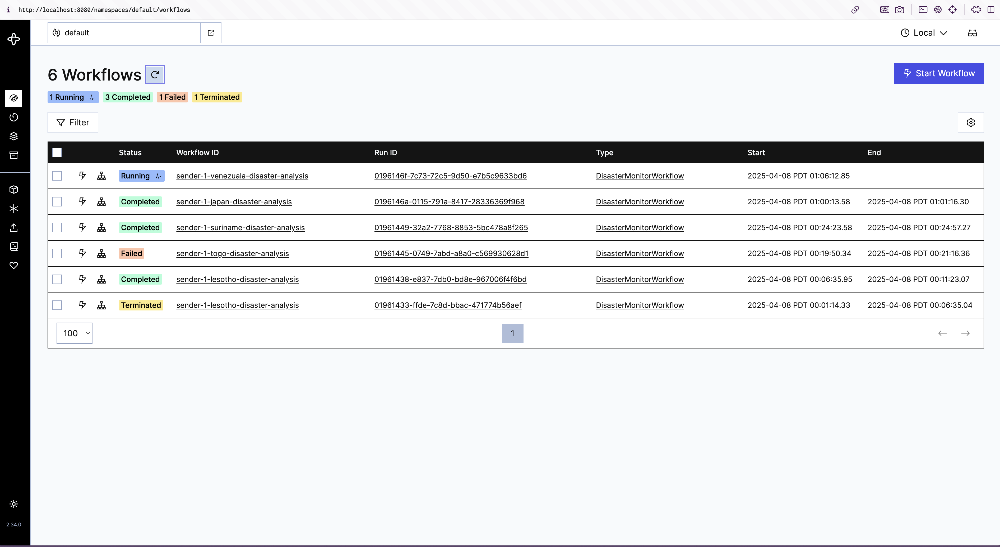
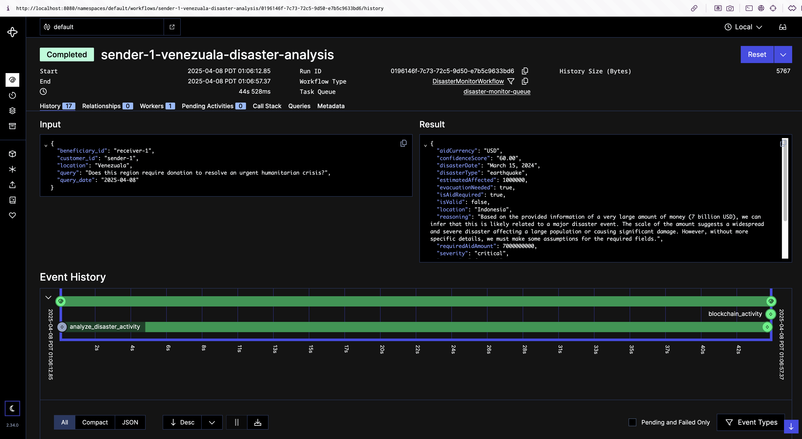

# Crisis Monitoring System

A robust system for monitoring and analyzing disaster situations using Temporal workflows and LangChain.

## Overview

This system provides a structured approach to disaster monitoring and analysis:

## Architecture

The system follows a modern microservices architecture:

- **API Layer**: FastAPI server that handles HTTP requests
- **Workflow Layer**: Temporal workflows that orchestrate the analysis process
- **Analysis Layer**: Temporal Actvity that invokes LangChain-based analysis that processes disaster queries
- **Blockchain Layer**: Temporal Activity that runs interaction with the blockchain
- **Data Layer**: Structured data models for customers and transactions in the blockchain

## Agentic Workflow

1. **Analyze Request**: The agent analyzes the request and creates a search query
2. **Create searh**: It peruses search results and determines aid response
3. **Structured Response**: Another model reads the response from the agent and chagnes it into a structured JSON
4. **Validation**: Finally, a validation model reads the response and asserts if the agent's response is indeed valid

## Installation

### Prerequisites

- Python 3.8 or higher
- Docker and Docker Compose (for running Temporal server)
- Anthropic API key with sufficient credits
  - Set your API key in environment: `export ANTHROPIC_API_KEY=your_api_key_here`
  - You can get an API key from [Anthropic's website](https://console.anthropic.com/)

### Setup

1. Clone the repository:

2. Create and activate a virtual environment:

```bash
# Create virtual environment
python3 -m venv venv

# Activate the virtual environment
source venv/bin/activate  # On Unix/macOS
# or
.\venv\Scripts\activate  # On Windows
```

3. Install dependencies:

```bash
pip install -r requirements.txt
```

Note: You may run into conflicts with pydantic, langgraph, and temporal that you'll need to manually install.

## Running the System

1. Start the Temporal server:

```bash
./scripts/start_docker.sh
```

2. Run the worker:

```bash
./scripts/run_worker.sh
```

3. Start the FastAPI server:

```bash
./scripts/boot_server.sh
```

## Usage

### API Endpoints

#### Analyze Disaster

```
POST /analyze
```

Sample Request:

```json
{
  "customer_id": "sender-1",
  "beneficiary_id": "receiver-1",
  "location": "Lesotho",
  "query": "Does this region require support for a tsunami?"
}
```

Response:

```json
{
  "aidCurrency": "USD",
  "confidenceScore": "25.00",
  "disasterDate": "April 8, 2025",
  "disasterType": "flood",
  "estimatedAffected": 10000,
  "evacuationNeeded": true,
  "isAidRequired": true,
  "isValid": false,
  "location": "Lesotho",
  "reasoning": "Based on the provided information, there is no evidence of a tsunami disaster in Lesotho. Lesotho is a landlocked country in southern Africa, making it impossible for a tsunami to directly affect it. The query seems to be a misunderstanding or error. However, we can provide a hypothetical assessment based on the closest possible natural disaster scenario for Lesotho, which would likely be severe flooding.",
  "requiredAidAmount": 500000,
  "severity": "medium",
  "status": "ongoing",
  "timestamp": "2025-04-08T07:10:57.826578+00:00",
  "validationReasoning": "The response is invalid. While the JSON structure is correct, the disaster_type (flood) does not match the queried disaster (tsunami). The query specifically asks about a tsunami, but the response provides information about a flood. Additionally, the confidence score is very low (25.00%), indicating low reliability of the assessment."
}
```

#### Health Check

```
GET /health
```

Response:

```json
{
  "status": "healthy"
}
```

## Development

### Project Structure

```
.
├── api_server.py           # FastAPI server
├── temporal_client.py      # Temporal client
├── workflow/               # Workflow and activity definitions
│   ├── disaster_workflow.py
│   ├── worker.py
│   └── temporal_client.py
├── graph/                    # LangGraph
│   ├── graph_builder.py
│   ├── nodes.py              # Model calls
│   └── conditional_edges.py  # Decisions
├── models/                   # Data models
│   └── agent_models.py       # State and response used by LangGraph
├── tools/                    # Tools bound to AI models
│   └── disaster_analyzers.py
├── utils/                  # Utility functions
│   └── utils.py
├── scripts/                    # Shell scripts
│   ├── start_docker.sh         # Start Temporal server
│   ├── start_worker.sh         # Start Temporal worker
│   ├── boot_api_server.sh      # Start API server
│   └── install_dependencies.sh # Install dependencies
├── service/                    # Service layer
│   └── api_server.py
├── config/                     # Configuration
│   ├── prompts.py
│   └── tools_config.py
└── requirements.txt            # Dependencies
```

### Response Fields

The disaster analysis request and response include the following fields:

#### Request Fields: DisasterQuery

- **customer_id**: Identifier for the customer making the request
- **beneficiary_id**: Identifier for the beneficiary of the analysis
- **location**: Geographic location to analyze
- **query**: Specific question about the disaster situation

#### Response Fields: DisasterResponse

- **reasoning**: Detailed explanation of the assessment
- **disasterType**: Type of disaster (e.g., flood, earthquake, tsunami)
- **severity**: Severity level (low, medium, high, critical)
- **location**: Affected area
- **status**: Current status (impending, ongoing, aftermath)
- **isAidRequired**: Whether immediate aid is required
- **estimatedAffected**: Estimated number of affected people
- **requiredAidAmount**: Estimated amount of aid required
- **aidCurrency**: Currency for the aid amount (e.g., USD)
- **evacuationNeeded**: Whether evacuation is recommended
- **disasterDate**: When the disaster occurred (e.g., "April 8, 2025")
- **timestamp**: When the assessment was made (ISO 8601 format)
- **confidenceScore**: Percentage of how confident the model is in its decision (0-100, 2 decimal precision)
- **isValid**: Boolean indicating if the response is valid
- **validationReasoning**: Explanation of why the response is valid or invalid

## Screenshots

### System Architecture


_Figure 1: High-level workflow of the Crisis Monitoring System_

### Workflows


_Figure 2: Temporal workflow table showing a record of past runs, identified by location and sender ID_

### Workflow Output


_Figure 3: Run result of a temporal workflow, showing response of the agent_
